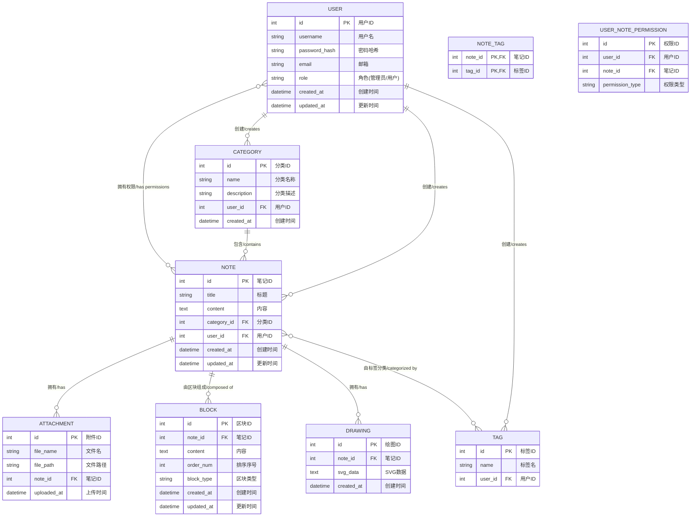

# 笔记软件需求分析文档

## 1. 项目简介
本项目旨在开发一款类似 Notion 的模块化笔记软件，支持服务端和网页端实现，满足用户多样化记录和管理笔记的需求。核心功能包括笔记的分类、搜索、展示和编辑，同时支持丰富的交互体验。

---

## 2. 功能需求

### 2.1 笔记分类
1. **自动分类**：
   - 根据用户自定义的标签对笔记进行分类。
   - 提供简单的规则配置（如关键词匹配）实现分类。

2. **手动分类**：
   - 用户可手动将笔记移动到特定分类中。

---

### 2.2 全局搜索
1. **搜索范围**：
   - 支持搜索笔记标题和内容。
   - 搜索结果按关键词精确匹配。

2. **搜索性能**：
   - 优化小规模数据库的查询性能。
   - 支持简单的搜索过滤（如按日期范围）。

---

### 2.3 笔记展示
1. **Markdown 支持**：
   - 支持 Markdown 语法的实时渲染。
   - 支持 Markdown 文件的导入与导出。

2. **图文并茂**：
   - 支持图片嵌入。
   - 图片支持简单的拖拽上传。

3. **段落区块设计**：
   - 段落内容按区块设计，每个区块可以单独编辑。

---

### 2.4 手绘功能
1. 提供类似画板的手绘功能，支持：
   - 手绘图形、文字注释。
   - 支持撤销、重做。

---

### 2.5 其他功能
1. **多端同步**：
   - 暂时通过简单的文件上传与下载实现同步。

2. **权限管理**：
   - 支持笔记的只读与编辑权限切换。

---

## 3. 非功能需求

1. **性能**：
   - 支持单一用户的笔记管理，目标支持 1,000+ 笔记。
   - 后端接口响应时间 < 500ms。

2. **安全性**：
   - 数据传输采用 HTTPS 加密。
   - 用户数据存储采用简单的哈希算法加密。

3. **可扩展性**：
   - 设计简单，便于后续扩展功能。

---

## 4. 技术栈选择

### 4.1 后端技术栈
1. **框架**：
   - Spring Boot：快速开发 RESTful 接口。
2. **数据库**：
   - MySQL：存储笔记数据。
3. **存储**：
   - 本地文件系统：用于存储图片和附件。
4. **安全**：
   - Spring Security：实现简单的用户认证。

---

### 4.2 前端技术栈
1. **基础框架**：
   - React：开发动态用户界面。
2. **状态管理**：
   - React 内置的 Context API：实现轻量的状态管理。
3. **UI 框架**：
   - Ant Design：快速构建美观的 UI。
4. **绘图工具**：
   - Fabric.js：实现手绘功能。
5. **富文本编辑器**：
   - React-Quill：支持 Markdown 和基本的富文本编辑。

---

### 4.3 DevOps 技术栈
1. **版本管理**：
   - Git + GitHub：托管代码和版本管理。
2. **部署**：
   - 使用 Spring Boot 的内嵌服务器直接运行 Jar 包进行部署。

---

## 5. 项目结构建议
```
/backend    # 后端代码（Spring Boot 项目）
/frontend   # 前端代码（React 项目）
/docs       # 文档与需求分析
```

---

## 6. 项目风险与解决方案
1. **性能瓶颈**：
   - 优化数据库索引，减少查询时间。
2. **开发复杂度**：
   - 简化功能，逐步迭代开发。
3. **数据安全性**：
   - 简单加密，后续可以逐步引入更高等级的安全机制。

---

## 7. 开发计划
1. **阶段 1**：基础功能开发（分类、搜索、Markdown 支持）。
2. **阶段 2**：手绘功能与区块设计开发。
3. **阶段 3**：优化与测试，完成简单同步功能。
4. **阶段 4**：上线与用户反馈迭代。

---

## 8. 系统设计

### 8.1 系统功能图


### 8.2 E-R图



### 8.3 数据库表设计

基于功能需求和E-R图，以下是MySQL数据库表设计：

#### 8.3.1 用户表(users/用户)

```sql
CREATE TABLE users (
    id INT AUTO_INCREMENT PRIMARY KEY COMMENT '用户ID，主键',
    username VARCHAR(50) NOT NULL UNIQUE COMMENT '用户名，唯一',
    password_hash VARCHAR(255) NOT NULL COMMENT '密码哈希值',
    email VARCHAR(100) NOT NULL UNIQUE COMMENT '电子邮箱，唯一',
    role ENUM('admin', 'user') NOT NULL DEFAULT 'user' COMMENT '角色：管理员/普通用户',
    created_at TIMESTAMP DEFAULT CURRENT_TIMESTAMP COMMENT '创建时间',
    updated_at TIMESTAMP DEFAULT CURRENT_TIMESTAMP ON UPDATE CURRENT_TIMESTAMP COMMENT '更新时间',
    last_login TIMESTAMP NULL COMMENT '最后登录时间',
    avatar_path VARCHAR(255) COMMENT '头像路径',
    status ENUM('active', 'inactive', 'locked') DEFAULT 'active' COMMENT '账户状态：活跃/非活跃/锁定'
) COMMENT '用户信息表';
```

#### 8.3.2 分类表(categories/分类)

```sql
CREATE TABLE categories (
    id INT AUTO_INCREMENT PRIMARY KEY COMMENT '分类ID，主键',
    name VARCHAR(50) NOT NULL COMMENT '分类名称',
    description VARCHAR(255) COMMENT '分类描述',
    user_id INT NOT NULL COMMENT '创建者ID，外键',
    created_at TIMESTAMP DEFAULT CURRENT_TIMESTAMP COMMENT '创建时间',
    FOREIGN KEY (user_id) REFERENCES users(id) ON DELETE CASCADE,
    UNIQUE KEY (name, user_id) COMMENT '同一用户下分类名唯一'
) COMMENT '笔记分类表';
```

#### 8.3.3 笔记表(notes/笔记)

```sql
CREATE TABLE notes (
    id INT AUTO_INCREMENT PRIMARY KEY COMMENT '笔记ID，主键',
    title VARCHAR(255) NOT NULL COMMENT '笔记标题',
    content TEXT COMMENT '笔记内容',
    category_id INT COMMENT '所属分类ID，外键',
    user_id INT NOT NULL COMMENT '创建者ID，外键',
    created_at TIMESTAMP DEFAULT CURRENT_TIMESTAMP COMMENT '创建时间',
    updated_at TIMESTAMP DEFAULT CURRENT_TIMESTAMP ON UPDATE CURRENT_TIMESTAMP COMMENT '更新时间',
    is_deleted BOOLEAN DEFAULT FALSE COMMENT '是否删除（软删除）',
    FOREIGN KEY (category_id) REFERENCES categories(id) ON DELETE SET NULL,
    FOREIGN KEY (user_id) REFERENCES users(id) ON DELETE CASCADE,
    INDEX (user_id, category_id) COMMENT '索引：用户ID和分类ID',
    INDEX (title) COMMENT '索引：标题（用于搜索）'
) COMMENT '笔记表';
```

#### 8.3.4 标签表(tags/标签)

```sql
CREATE TABLE tags (
    id INT AUTO_INCREMENT PRIMARY KEY COMMENT '标签ID，主键',
    name VARCHAR(30) NOT NULL COMMENT '标签名称',
    user_id INT NOT NULL COMMENT '创建者ID，外键',
    FOREIGN KEY (user_id) REFERENCES users(id) ON DELETE CASCADE,
    UNIQUE KEY (name, user_id) COMMENT '同一用户下标签名唯一'
) COMMENT '标签表';
```

#### 8.3.5 笔记标签关联表(note_tags/笔记标签关联)

```sql
CREATE TABLE note_tags (
    note_id INT NOT NULL COMMENT '笔记ID，联合主键之一',
    tag_id INT NOT NULL COMMENT '标签ID，联合主键之一',
    PRIMARY KEY (note_id, tag_id),
    FOREIGN KEY (note_id) REFERENCES notes(id) ON DELETE CASCADE,
    FOREIGN KEY (tag_id) REFERENCES tags(id) ON DELETE CASCADE
) COMMENT '笔记与标签的关联表';
```

#### 8.3.6 附件表(attachments/附件)

```sql
CREATE TABLE attachments (
    id INT AUTO_INCREMENT PRIMARY KEY COMMENT '附件ID，主键',
    file_name VARCHAR(255) NOT NULL COMMENT '文件名',
    file_path VARCHAR(255) NOT NULL COMMENT '文件路径',
    file_type VARCHAR(50) COMMENT '文件类型',
    file_size INT COMMENT '文件大小（字节）',
    note_id INT NOT NULL COMMENT '所属笔记ID，外键',
    uploaded_at TIMESTAMP DEFAULT CURRENT_TIMESTAMP COMMENT '上传时间',
    FOREIGN KEY (note_id) REFERENCES notes(id) ON DELETE CASCADE
) COMMENT '附件表';
```

#### 8.3.7 内容区块表(blocks/内容区块)

```sql
CREATE TABLE blocks (
    id INT AUTO_INCREMENT PRIMARY KEY COMMENT '区块ID，主键',
    note_id INT NOT NULL COMMENT '所属笔记ID，外键',
    content TEXT COMMENT '区块内容',
    order_num INT NOT NULL COMMENT '排序序号，控制显示顺序',
    block_type ENUM('text', 'image', 'code', 'list', 'quote', 'heading') NOT NULL COMMENT '区块类型：文本/图像/代码/列表/引用/标题',
    created_at TIMESTAMP DEFAULT CURRENT_TIMESTAMP COMMENT '创建时间',
    updated_at TIMESTAMP DEFAULT CURRENT_TIMESTAMP ON UPDATE CURRENT_TIMESTAMP COMMENT '更新时间',
    FOREIGN KEY (note_id) REFERENCES notes(id) ON DELETE CASCADE
) COMMENT '内容区块表';
```

#### 8.3.8 手绘表(drawings/手绘)

```sql
CREATE TABLE drawings (
    id INT AUTO_INCREMENT PRIMARY KEY COMMENT '绘图ID，主键',
    note_id INT NOT NULL COMMENT '所属笔记ID，外键',
    svg_data TEXT NOT NULL COMMENT 'SVG矢量图数据',
    created_at TIMESTAMP DEFAULT CURRENT_TIMESTAMP COMMENT '创建时间',
    FOREIGN KEY (note_id) REFERENCES notes(id) ON DELETE CASCADE
) COMMENT '手绘图表';
```

#### 8.3.9 用户笔记权限表(user_note_permissions/用户笔记权限)

```sql
CREATE TABLE user_note_permissions (
    id INT AUTO_INCREMENT PRIMARY KEY COMMENT '权限ID，主键',
    user_id INT NOT NULL COMMENT '用户ID，外键',
    note_id INT NOT NULL COMMENT '笔记ID，外键',
    permission_type ENUM('read', 'edit') NOT NULL DEFAULT 'read' COMMENT '权限类型：只读/编辑',
    granted_at TIMESTAMP DEFAULT CURRENT_TIMESTAMP COMMENT '授权时间',
    granted_by INT NOT NULL COMMENT '授权人ID，外键',
    FOREIGN KEY (user_id) REFERENCES users(id) ON DELETE CASCADE,
    FOREIGN KEY (note_id) REFERENCES notes(id) ON DELETE CASCADE,
    FOREIGN KEY (granted_by) REFERENCES users(id),
    UNIQUE KEY (user_id, note_id) COMMENT '用户和笔记的组合唯一'
) COMMENT '用户笔记权限表';
```
